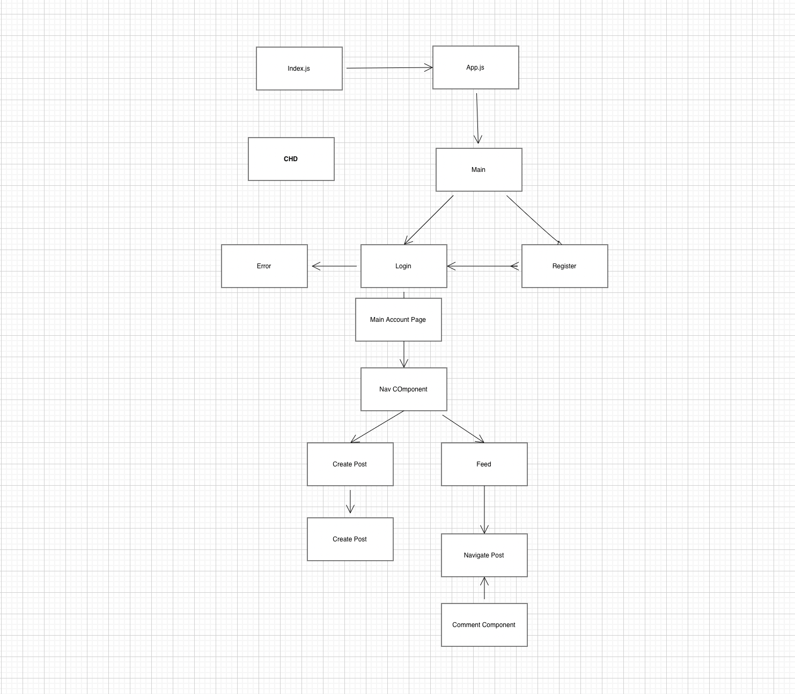
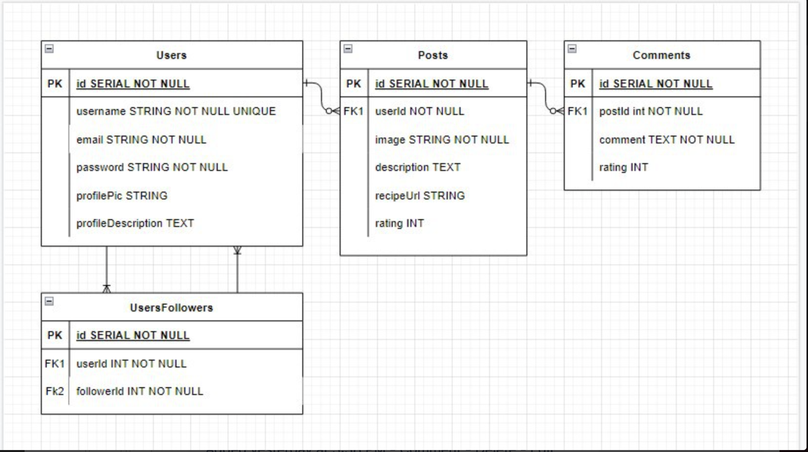

# Foodle

Our vision behind this app is a mock up version of flickr for food. 
Adding to the recipe book idea, each user will be able to post pictures 
of thier own recipes along with the rating they would give it.
Other users will be allowed to comment on said posts and rate them 
after trying the recipe and can give it their own rating giving peoples 
recipes a sense of credibility to the recipes people post.

[Trello](https://trello.com/c/Fphk4xoz/14-screen-shot-2022-04-14-at-31858-pmpng)   
[Front End](https://github.com/Neoj1sec142/Foodle-Front)   
[Back End](https://github.com/timmellis/Foodle-Back)   

## Features:
[] Front to Back JWT Auth   
[] Users Able to Post & Comment on other Posts   
[] Read Access only to user posts    
[] PostgreSQL & Sequelize Back End    
[] React & Redux Front End   
[] Rating System for User on their own posts   
[] Rating system on User Comments of other user posts  
[] Full CRUD:
* [] Create
* [] Read
* [] Update
* [] Delete  
[] Stretch: Onclick for post should drop down of recipe   
[] Stretch: Overall Rating on Comment System give average rating of users recipe post credibility at top of profile

***
## Component Heirarchy Diagram:
   
***
## Enitity Relationship Diagram:

***
## WireFrame Basic Layout Idea:

***
### Installs List Front End:
* axios 
* react-redux
* react-router-dom
* react-stars
* redux devtools extension
* redux-thunk

***
### Tech Used Overall Project:
* React
* Redux (possible)
* PostgreSQL
* Express 
* Sequelize
* Javascript
* JWT Authentication
***

### Created By:
[Tim Ellis](https://github.com/timmellis)   
[LinkedIn]()   
[Joshua Grainger](https://github.com/joshgrainger22)   
[LinkedIn]()   
[Mark Harmon](https://github.com/Neoj1sec142)    
[LinkedIn]()   
***
#### Credits: